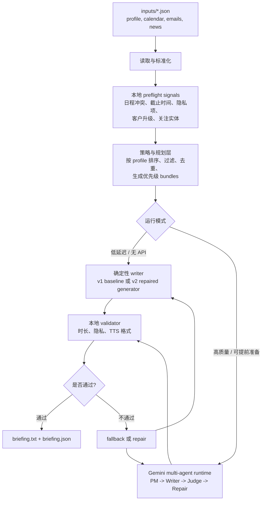
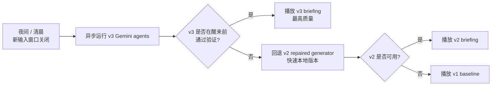
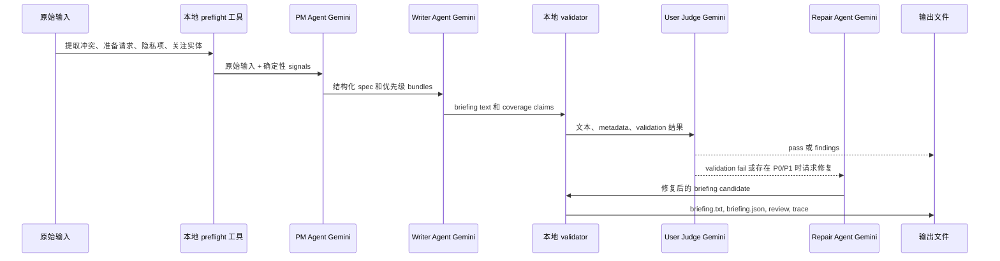

# DECISIONS

## 1. 架构



真实产品里我不会只押单一路径。LLM 路径负责提高质量上限，确定性路径负责兜住延迟和稳定性下限。



## 2. 关键设计决策

### 多步 Agent，而不是一次性总结

这个任务不应该把四个 JSON 一股脑丢给 LLM，然后让它“总结一下”。真正重要的是判断：哪些内容要说，哪些要丢，如何尊重隐私，如何跨日程/邮件/新闻去重，如何在 `briefing.json` 里解释这些选择。

当前实现采用多步 pipeline：

1. 读取并标准化四份输入。
2. 根据 profile 做排序、过滤和优先级判断。
3. 检测日程冲突、private 事件、action-required 邮件等边界情况。
4. 跨 calendar、email、news 合并同一真实事件。
5. 生成一个紧凑的 briefing plan。
6. 用 writer 生成 TTS 友好的朗读文本。
7. 用 validator 检查时长、隐私、Markdown/URL/email、数字口语化等约束，并生成 metadata。

### 三个版本的定位和最终取舍

我做了三个版本，因为这个产品同时有两个互相拉扯的目标：简报质量要高，但用户早上不应该等一个不稳定的 LLM 链路。

| 版本 | 运行方式 | 最适合的场景 | 主要优势 | 主要劣势 |
|---|---|---|---|---|
| v1 deterministic baseline | 运行 `vibe_coding_1_0/deterministic_baseline/` 下的本地规则和确定性 writer | 五分钟内可复现的本地运行、兜底版本 | 快、稳、无 API key、隐私风险低 | 更像规则系统；语言质量上限较低；早期输出暴露了过多私人上下文 |
| v2 Codex repaired generator | 运行 `multi_agent_workflow/outputs/review_repair_1/` 下优化后的本地 generator | 低延迟生产候选 | 比 v1 优先级更清楚，TTS 质量更好，同时保持本地可运行 | multi-agent 优化循环本身不是 runtime service；漏掉了 Vertex Capital 客户升级 |
| v3 Gemini runtime multi-agent | 运行时调用 Gemini，完成 PM、Writer、User Judge、Repair | 对延迟不敏感、可以提前准备的高质量场景 | 用户结果质量上限最高，语义理解能力最强 | 依赖网络/API；会把用户派生数据发到 ModelHub；metadata coverage 还需要更强的本地校验 |

如果目标是生成质量最高、最像真实用户会愿意听的 `briefing.txt`，我会选 v3。它最好地覆盖了 Jordan 当天真正有后果的事项：两点前的 board deck、十点半 Priya recommendation、Plaid credential rotation、PSD3 准备、Vertex Capital escalation、Maya/ACME 冲突、Cobalt launch、Stripe context 和 Lyra 竞品动态。

如果目标是低延迟、可本地稳定运行、无 API 依赖，我会选 v2。它是比 v1 更强的本地 generator，而且不需要 API key 或网络。

实际产品策略应该是混合：

1. 在用户醒来前异步运行 v3。
2. 如果 v3 按时完成并通过本地 validation，就播放 v3。
3. 如果 v3 超时、不可用，或隐私/TTS validation 不通过，就回退到 v2。
4. v1 保留为最简单的 deterministic baseline 和本地兜底 reference。

一句话总结：LLM agents 提高上限，deterministic generation 兜住下限。

### LLM 应该放在哪里

生产版本里，LLM 不应该替代所有本地规则，而应该和本地工具组合使用。

选择、隐私过滤、时长检查、TTS 格式检查和 dropped-item accounting 应尽量保持确定性，因为这些部分需要可审计。LLM 更适合做语义规划、自然语言生成、用户视角评审和修复。

默认运行路径仍然是 no-API 的本地版本，因为这个项目需要在没有外部服务配置的情况下也能快速跑通。

可选的 v3 路径在 `llm_runtime_workflow/` 下，是真正调用 Gemini 的 multi-agent loop：



### 信息筛选和优先级

筛选策略优先考虑：

- profile 中的 tracked entities：Cobalt Labs、Stripe、Plaid、Lyra Finance、Maya Chen；
- action-required、高权威来源、高后果邮件，例如 CEO、partner、compliance、operational risk；
- 会影响准备、排序或冲突处理的日程；
- 与 Jordan 角色相关的 fintech regulation、platform/product news。

会被丢弃或降权的内容：

- sports 和 entertainment；
- day-to-day crypto price movement，但 crypto regulation 或 enforcement 可以保留；
- 自动通知和促销邮件，除非它们包含 tracked entity 或重要 operational issue；
- 和产品应用无关的纯 AI benchmark 新闻。

### Calendar 和 Email 的去重

Calendar 和 email 不是简单互斥的重复项。它们通常提供同一真实事件的不同维度：

- calendar 提供时间、顺序、地点、参与人和冲突；
- email 提供意图、准备事项、deadline 或最新上下文。

因此 planner 会把它们合并成 event bundle，而不是直接删除其中一边。例如：

- `cal_003` + `em_002`：Priya one-on-one，以及她要求 Jordan 准备是否把 payments API GA 提前两周的 recommendation。
- `cal_005` + `em_003`：Stripe lunch，加上 Jess Park 参会和 Stripe Issuing 可能被讨论的上下文。
- `cal_006` + `em_008`：Maya call，但 spoken output 只应讲通话/冲突，不应暴露家庭或生日计划细节。
- `cal_008` + `em_001`：board prep，以及 Alex 要求两点前 review payments revenue slides。
- `cal_009` + `em_011` + `news_002`：PSD3 sync、Rahul 的 action-required 邮件，以及 Reuters 对 final EU text 的确认。

朗读文本应该每个 bundle 只说一次；`briefing.json` 则保留所有被覆盖的 source IDs，方便审计。

### 个性化边界

这份数据是 Jordan Chen 的一天，所以输出针对 Jordan 优化。但系统设计不能把 Jordan 写死成应用逻辑。Jordan 应该被视为一个由 `profile.json` 配置出来的 persona。

生产版的优先级可以分三层：

1. 通用后果信号：deadline、explicit owner、action-required label、calendar conflict、private/sensitive handling、security/legal/compliance risk、executive request、meeting prep。
2. 人群/角色策略：product leader、on-call engineer、sales/account owner、finance/legal operator、executive assistant 等不同用户群的 P0 trigger 不一样。
3. 用户个人 profile：tracked entities、not-interested topics、tone、personal exception。

LLM 可以帮助从历史数据中总结 cluster-level trigger phrases，但最终 P0/P1/P2/P3 的判定最好仍然是显式、可审计的策略。

### Profile 如何进入结果

Profile 不是只塞进 prompt 里，而是在三处生效：

1. 正向选择：tracked entities 获得优先级提升。因此 Cobalt launch、Stripe lunch、Plaid rotation、Lyra competitor update、Maya conflict 会被优先考虑。
2. 负向过滤：`not_interested` 中的 sports、entertainment、day-to-day crypto price movement 被过滤或降权。
3. 输出约束：writer 遵守 warm but efficient 的语气，不用固定的 “Good morning”，不用 URL/email，数字口语化，句子适合无视觉上下文收听。

关键点是：profile 不是装饰性 prompt，而是影响 filtering、ranking、wording 和 validation 的真实策略输入。

### 初读数据发现的坑

- `cal_006` 和 `cal_007` 从一点十五到一点半冲突，必须提醒 Jordan 做取舍。
- `cal_011` 是 private，不能暴露细节。
- `em_020` 是个人医疗预约确认，不应该读出医疗细节。
- PSD3 同时出现在 calendar、email、news，应合并为一个点，不要重复三遍。
- Bitcoin price movement 同时出现在 email 和 news，但 profile 明确不关心 day-to-day crypto price movement。
- 数据里混有 sports 和 entertainment，应过滤。
- Maya 是 tracked entity，但私人家庭/生日细节不应被读出来。

### 时长控制

目标是七十五秒，允许范围是六十到九十秒。当前估算使用一百五十 words per minute：

```text
estimated_seconds = word_count / 150 * 60
```

也就是说，最终 briefing 通常应该落在一百八十到二百一十个英文词左右。v1.0 baseline 输出是二百一十二词，估算八十五秒；v2 repaired generator 输出是二百一十一词，估算八十四秒；v3 runtime 输出是 一百九十一词，估算七十六秒，均在要求范围内。

### Metadata 字段

`briefing.json` 主要包含：

- `generated_for`：用户、日期、时区。
- `covered_item_ids`：朗读文本实际覆盖的 calendar / emails / news IDs。
- `duration_estimate`：词数、估算秒数和估算方法。
- `sections`：`briefing.txt` 里的字符区间，以及每段覆盖的 input IDs。
- `calendar_conflicts_detected`：显式检测出的日程冲突。
- `dropped_items`：主动丢弃的 items 及原因。
- `validation`：TTS、隐私和时长检查。
- `notes`：帮助后续排查和理解输出的实现说明。

### TTS 友好性

`briefing.txt` 应该是适合直接朗读的纯文本：

- 无 Markdown 标记；
- 无 URL；
- 无 email 地址；
- 数字和单位口语化，例如 "twelve percent" 而不是 "12%"；
- 不每天都用同样的开头；
- 句子短而明确，因为用户听的时候没有视觉上下文。

## 3. AI 工具使用记录

- 我使用 Codex 作为设计和实现伙伴。
- 人主导的决策包括：不做 one-shot summarization；保留确定性 selection 和 metadata；让 LLM 主要负责规划、写作、评审和修复；保留 no-API fallback。
- Codex 帮助阅读输入数据、识别隐藏 edge cases、编写初版代码、生成音频预览、运行 review-repair 循环，以及实现 Gemini runtime multi-agent 版本。
- 讨论中的一个重要修正：不要一上来写代码，而是先理解数据陷阱和系统边界。
- review 中发现的一个具体问题：初版 metadata 曾把“进入候选集但未真正说出口”的 items 也算成 covered。后续改为更谨慎地记录 coverage，并把未说出口但相关的项目放到 `dropped_items`。
- Gemini runtime 版本暴露了另一个真实问题：LLM writer 会自报 coverage claims，但这些 claims 仍需要本地二次校验，否则可能出现 `briefing.json` 声称覆盖了某个 item，而 spoken text 没有实际提到的情况。

## 4. 已知限制

- v1/v2 本地 generator 使用显式规则，还不是完整的生产级 retrieval/ranking 系统。
- 确定性 writer 比 LLM writer 稳定，但语言弹性较低。
- 时长估算基于 word count，不是真实 TTS 音频时间。
- v3 runtime 依赖 API 和网络，并会把用户派生数据发到 ModelHub。
- v3 的 metadata coverage 仍部分依赖 Writer Agent 自报，未来应该加入更强的 source-grounded coverage verifier。

## 5. 如果再多两个小时

如果再多两个小时，我会把重点放在产品化边界，而不是继续堆 prompt：

- 扩展到通用接口，将inputs改成tools调用结果，准备memory记录用户反馈，更新profile等。
- 构造几组非 Jordan 的测试用户数据，例如 product leader、on-call engineer、sales/account owner、finance/legal operator，用来验证 P0 召回、隐私、去重、profile adherence 和时长控制不是只对当前样例手工有效。
